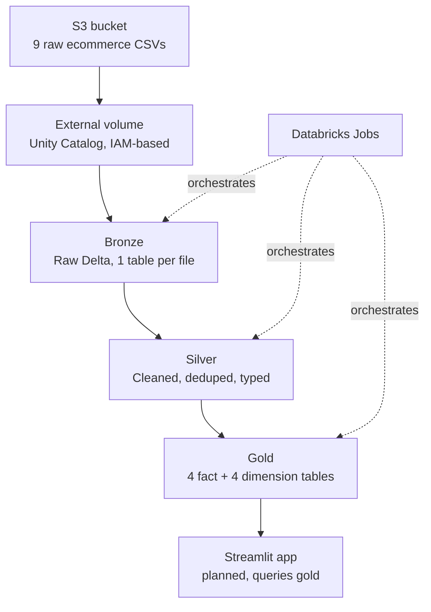
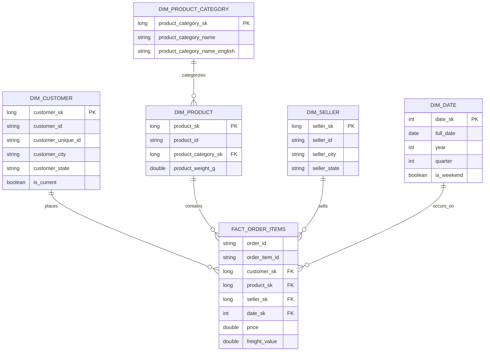

# E-Commerce Medallion Data Pipeline — Databricks, PySpark & AWS S3

An end-to-end batch data pipeline that ingests raw e-commerce data from AWS S3, processes it through a Medallion Architecture (Bronze → Silver → Gold) using PySpark on Databricks, and models it into a Snowflake schema of analytics-ready fact and dimension tables — fully orchestrated with Databricks Jobs.

# Dataset
https://www.kaggle.com/datasets/olistbr/brazilian-ecommerce

# Architecture diagrams

## Pipeline flow



## Gold layer — snowflake schema



**Why snowflake, not star:** `DIM_PRODUCT_CATEGORY` connects only to `DIM_PRODUCT`, not directly to the fact table — that one-hop-removed relationship is what makes this a snowflake schema rather than a fully flattened star.

## Overview

| | |
|---|---|
| **Source data** | 9 raw CSV files (Olist-style e-commerce dataset: customers, orders, order items, payments, reviews, products, product categories, sellers) |
| **Storage** | AWS S3 (raw landing zone), connected to Databricks via an External Volume |
| **Processing** | PySpark notebooks, organized into Bronze / Silver / Gold layers |
| **Orchestration** | Databricks Jobs (multi-task workflow, notebook-per-layer) |
| **Modeling** | Snowflake schema — 4 fact table, 4 dimension tables |
| **Scale** | ~97,000 customer records, ~200,000 order records, plus order items, payments, reviews, products, and sellers |

## Architecture

```
                 ┌─────────────────┐
                 │   AWS S3 Bucket   │
                 │  (9 raw CSVs)     │
                 └────────┬─────────┘
                          │  External Volume (Unity Catalog)
                          ▼
                 ┌─────────────────┐
                 │  BRONZE LAYER     │  Raw ingestion, schema-on-read,
                 │  (Delta tables)   │  minimal transformation, audit columns
                 └────────┬─────────┘
                          ▼
                 ┌─────────────────┐
                 │  SILVER LAYER     │  Cleansing, deduplication, type casting,
                 │  (Delta tables)   │  null handling, referential checks
                 └────────┬─────────┘
                          ▼
                 ┌─────────────────┐
                 │  GOLD LAYER       │  Dimensional modeling — Snowflake schema
                 │  (Delta tables)   │  4 fact table + 4 dimension tables
                 └────────┬─────────┘
                          ▼
                 ┌─────────────────┐
                 │  Databricks Jobs  │  Orchestrates Bronze → Silver → Gold
                 │  (scheduled)      │  as a dependency-ordered workflow
                 └──────────────────┘
```

## Data model (Gold layer — Snowflake schema)

**Fact table**
- `fact_orders` — one row per order/order-item grain, with foreign keys to every dimension below and measures such as price, freight value, payment value, and review score.

**Dimension tables**
- `dim_customers` — customer attributes (location, unique customer ID vs. customer ID for repeat-purchase tracking)
- `dim_products` — product attributes joined with product category translations
- `dim_sellers` — seller attributes and location
- `dim_date` — a standard calendar/date dimension (day, month, quarter, year, weekday) generated for time-based analysis

A snowflake schema (rather than a flat star schema) was used because `dim_products` normalizes out to a separate product-category reference rather than flattening every category attribute directly into the dimension — reducing redundancy at the cost of one extra join.

## Connecting Databricks to S3

There are two common ways to connect Databricks to S3 — this project uses Unity Catalog **External Locations + Volumes**, which is the current recommended approach over legacy instance profiles or mounted storage:

1. **Create an IAM role in AWS** that trusts the Databricks account and grants least-privilege access (`s3:GetObject`, `s3:ListBucket`, `s3:PutObject` as needed) scoped to the specific bucket/prefix.
2. **Create a Storage Credential in Unity Catalog** that references that IAM role — this is the reusable, catalog-level object that holds the AWS trust relationship instead of hardcoding keys anywhere.
3. **Create an External Location** pointing at the S3 URI (`s3://your-bucket/raw-data/`) and attach the storage credential to it. This registers the bucket path as a governed, permissioned object inside Unity Catalog.
4. **Create an External Volume** on top of the external location (`CREATE EXTERNAL VOLUME`). This exposes the S3 path as a filesystem-style path inside Databricks (`/Volumes/catalog/schema/volume_name/...`) that notebooks can read from directly with standard file APIs — no boto3, no access keys, no SDK calls in notebook code.
5. Notebooks then read files with a plain path, e.g. `spark.read.csv("/Volumes/ecommerce/raw/s3_landing/orders.csv")`, and Unity Catalog enforces access control transparently.

This keeps credentials out of notebook code entirely and gives centralized, auditable governance over who/what can read the raw zone — a meaningfully better pattern than embedding AWS access keys in a notebook or cluster config.

## Bronze layer

**Goal:** land the 9 raw CSVs as Delta tables with minimal transformation, preserving the raw shape of the data plus ingestion metadata for lineage/auditability.

```python
# 01_bronze_ingestion.py
from pyspark.sql import SparkSession
from pyspark.sql.functions import current_timestamp, input_file_name, lit

spark = SparkSession.builder.getOrCreate()

VOLUME_PATH = "/Volumes/ecommerce/raw/s3_landing"
BRONZE_SCHEMA = "ecommerce.bronze"

SOURCE_FILES = {
    "customers":        "olist_customers_dataset.csv",
    "orders":           "olist_orders_dataset.csv",
    "order_items":      "olist_order_items_dataset.csv",
    "order_payments":   "olist_order_payments_dataset.csv",
    "order_reviews":    "olist_order_reviews_dataset.csv",
    "products":         "olist_products_dataset.csv",
    "product_category":"product_category_name_translation.csv",
    "sellers":          "olist_sellers_dataset.csv",
    "geolocation":      "olist_geolocation_dataset.csv",
}

for table_name, file_name in SOURCE_FILES.items():
    df = (
        spark.read
        .option("header", True)
        .option("inferSchema", True)   # bronze: permissive, schema tightened in silver
        .csv(f"{VOLUME_PATH}/{file_name}")
        .withColumn("_ingested_at", current_timestamp())
        .withColumn("_source_file", input_file_name())
        .withColumn("_source_system", lit("s3_ecommerce_raw"))
    )

    (
        df.write
        .format("delta")
        .mode("overwrite")           # full reload; see optimization notes for incremental pattern
        .option("overwriteSchema", "true")
        .saveAsTable(f"{BRONZE_SCHEMA}.{table_name}")
    )

    print(f"Bronze loaded: {table_name} — {df.count():,} rows")
```

## Silver layer

**Goal:** clean, deduplicate, enforce types, and apply data-quality rules. This is where raw strings become real types, nulls are handled deliberately, and duplicate keys are resolved.

```python
# 02_silver_transformation.py
from pyspark.sql import functions as F
from pyspark.sql.window import Window

BRONZE = "ecommerce.bronze"
SILVER = "ecommerce.silver"

# --- Customers ---
bronze_customers = spark.table(f"{BRONZE}.customers")

silver_customers = (
    bronze_customers
    .dropDuplicates(["customer_id"])
    .filter(F.col("customer_id").isNotNull())
    .withColumn("customer_zip_code_prefix", F.col("customer_zip_code_prefix").cast("string"))
    .withColumn("customer_city", F.trim(F.lower(F.col("customer_city"))))
    .withColumn("customer_state", F.upper(F.trim(F.col("customer_state"))))
    .select(
        "customer_id", "customer_unique_id", "customer_zip_code_prefix",
        "customer_city", "customer_state"
    )
)
silver_customers.write.format("delta").mode("overwrite") \
    .saveAsTable(f"{SILVER}.customers")

# --- Orders (illustrates dedup-keep-latest + type casting + null handling) ---
bronze_orders = spark.table(f"{BRONZE}.orders")

window_latest = Window.partitionBy("order_id").orderBy(F.col("_ingested_at").desc())

silver_orders = (
    bronze_orders
    .withColumn("rn", F.row_number().over(window_latest))
    .filter(F.col("rn") == 1)
    .drop("rn")
    .withColumn("order_purchase_timestamp", F.to_timestamp("order_purchase_timestamp"))
    .withColumn("order_delivered_customer_date", F.to_timestamp("order_delivered_customer_date"))
    .withColumn("order_estimated_delivery_date", F.to_timestamp("order_estimated_delivery_date"))
    .withColumn("order_status", F.lower(F.trim(F.col("order_status"))))
    .filter(F.col("order_id").isNotNull() & F.col("customer_id").isNotNull())
)
silver_orders.write.format("delta").mode("overwrite") \
    .saveAsTable(f"{SILVER}.orders")

# --- Data quality gate before promoting to silver (example pattern) ---
null_customer_ids = silver_orders.filter(F.col("customer_id").isNull()).count()
duplicate_order_ids = (
    silver_orders.groupBy("order_id").count().filter(F.col("count") > 1).count()
)
assert null_customer_ids == 0, "Silver orders: null customer_id found"
assert duplicate_order_ids == 0, "Silver orders: duplicate order_id found"

print(f"Silver customers: {silver_customers.count():,} rows")
print(f"Silver orders: {silver_orders.count():,} rows")
```

*(The same dedup → type-cast → null-check pattern is repeated for `order_items`, `order_payments`, `order_reviews`, `products`, `product_category`, and `sellers`.)*

## Gold layer

**Goal:** build the dimensional model — 4 dimension tables and 1 fact table, ready for BI/analytics consumption.

```python
# 03_gold_dimensional_model.py
from pyspark.sql import functions as F

SILVER = "ecommerce.silver"
GOLD = "ecommerce.gold"

# --- dim_customers ---
dim_customers = (
    spark.table(f"{SILVER}.customers")
    .withColumn("customer_key", F.monotonically_increasing_id())
    .select("customer_key", "customer_id", "customer_unique_id",
            "customer_city", "customer_state", "customer_zip_code_prefix")
)
dim_customers.write.format("delta").mode("overwrite").saveAsTable(f"{GOLD}.dim_customers")

# --- dim_products (snowflaked with category translation) ---
products = spark.table(f"{SILVER}.products")
categories = spark.table(f"{SILVER}.product_category")

dim_products = (
    products
    .join(categories, "product_category_name", "left")
    .withColumn("product_key", F.monotonically_increasing_id())
    .select("product_key", "product_id", "product_category_name_english",
            "product_weight_g", "product_length_cm", "product_height_cm", "product_width_cm")
)
dim_products.write.format("delta").mode("overwrite").saveAsTable(f"{GOLD}.dim_products")

# --- dim_sellers ---
dim_sellers = (
    spark.table(f"{SILVER}.sellers")
    .withColumn("seller_key", F.monotonically_increasing_id())
    .select("seller_key", "seller_id", "seller_city", "seller_state", "seller_zip_code_prefix")
)
dim_sellers.write.format("delta").mode("overwrite").saveAsTable(f"{GOLD}.dim_sellers")

# --- dim_date (generated calendar dimension) ---
dim_date = (
    spark.sql("SELECT explode(sequence(to_date('2016-01-01'), to_date('2020-12-31'), interval 1 day)) as date")
    .withColumn("date_key", F.date_format("date", "yyyyMMdd").cast("int"))
    .withColumn("year", F.year("date"))
    .withColumn("month", F.month("date"))
    .withColumn("quarter", F.quarter("date"))
    .withColumn("day_of_week", F.date_format("date", "EEEE"))
)
dim_date.write.format("delta").mode("overwrite").saveAsTable(f"{GOLD}.dim_date")

# --- fact_orders (broadcast joins against small dimensions — see optimization notes) ---
orders = spark.table(f"{SILVER}.orders")
order_items = spark.table(f"{SILVER}.order_items")
payments = spark.table(f"{SILVER}.order_payments")
reviews = spark.table(f"{SILVER}.order_reviews")

fact_orders = (
    order_items
    .join(orders, "order_id", "inner")
    .join(F.broadcast(dim_customers), "customer_id", "left")
    .join(F.broadcast(dim_products), "product_id", "left")
    .join(F.broadcast(dim_sellers), "seller_id", "left")
    .join(payments.groupBy("order_id").agg(F.sum("payment_value").alias("total_payment_value")),
          "order_id", "left")
    .join(reviews.select("order_id", "review_score"), "order_id", "left")
    .withColumn("order_date_key", F.date_format("order_purchase_timestamp", "yyyyMMdd").cast("int"))
    .select(
        "order_id", "order_item_id", "customer_key", "product_key", "seller_key",
        "order_date_key", "price", "freight_value", "total_payment_value",
        "review_score", "order_status"
    )
)
fact_orders.write.format("delta").mode("overwrite") \
    .partitionBy("order_status") \
    .saveAsTable(f"{GOLD}.fact_orders")

print(f"Gold fact_orders: {fact_orders.count():,} rows")
```

## Orchestration — Databricks Jobs

The three notebooks are chained as a single Databricks Job (Workflow) with explicit task dependencies:

```
Task 1: bronze_ingestion   (no dependency)
   └── Task 2: silver_transformation  (depends on Task 1)
         └── Task 3: gold_dimensional_model  (depends on Task 2)
```

Each task runs on a job cluster (spun up for the run and torn down after — cheaper than an always-on interactive cluster), and the job can be triggered on a schedule (e.g. daily/nightly) or on-demand. Task-level retry policies and email/webhook alerts on failure are configured at the job level so a failed Silver run doesn't silently let Gold run on stale or partial data.

## PySpark / Delta optimizations applied

| Optimization | Why it matters here |
|---|---|
| **Broadcast joins for dimension lookups** | `dim_customers`, `dim_products`, `dim_sellers` are all small relative to `order_items` (200K rows) — broadcasting them avoids an expensive shuffle join and turns a shuffle-heavy join into a map-side join |
| **Partitioning `fact_orders` by `order_status`** | Query patterns commonly filter by status (e.g. `delivered` vs `canceled`); partitioning lets Spark skip irrelevant files instead of scanning the full fact table |
| **Delta `OPTIMIZE` + `ZORDER`** | Running `OPTIMIZE ecommerce.gold.fact_orders ZORDER BY (order_date_key, customer_key)` compacts small files from repeated writes and co-locates data for the columns most queries filter/join on, reducing I/O |
| **Schema enforcement in Silver, not Bronze** | Bronze uses permissive `inferSchema` to never lose/reject raw data on ingest; strict typing is deferred to Silver where bad records can be explicitly filtered and logged rather than silently dropped at ingest time |
| **Deduplication via window functions (`row_number` over a partition), not `.distinct()`** | `.distinct()` can't express "keep the most recent record" — a ranked window function lets duplicate keys be resolved deterministically (latest `_ingested_at` wins) |
| **Explicit column selection over `SELECT *`** | Keeps Silver/Gold schemas intentional and avoids silently carrying bronze audit columns into analytics-facing tables |
| **Avoiding Python UDFs where a native Spark function exists** | Native functions (`F.to_timestamp`, `F.lower`, `F.trim`, etc.) run in the JVM without the Python-JVM serialization overhead a UDF incurs row-by-row |
| **Job clusters instead of interactive clusters for scheduled runs** | Job clusters terminate on completion, avoiding idle-cluster cost between the once-daily scheduled runs |
| **Data quality assertions as a gate between layers** | Explicit null/duplicate checks between Silver and Gold stop bad data from silently reaching the fact table rather than discovering it downstream in a dashboard |

## Planned enhancements

- **Streamlit application** connected directly to the Gold layer, allowing ad-hoc natural-language or parameterized queries to be run against the fact/dimension tables and returned as tables/charts in the app.
- **SCD Type 2 for `dim_customers`** — currently the dimension is fully overwritten on each run; the planned change adds `effective_start_date`, `effective_end_date`, and `is_current` columns so historical changes to a customer's attributes (e.g. city/state) are preserved rather than overwritten, using a Delta `MERGE` with change-detection logic instead of a full table overwrite.

## Tech stack

`AWS S3` · `Databricks` · `Unity Catalog` · `PySpark` · `Delta Lake` · `Databricks Jobs` · (planned: `Streamlit`)
